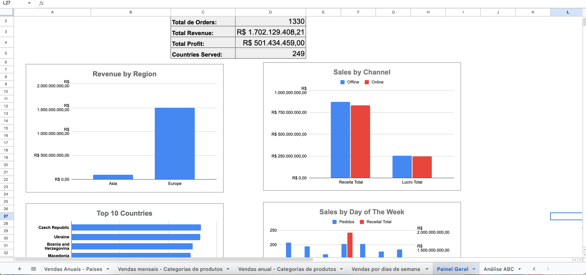

# Sales Data Analysis & Dashboard (Google Sheets)

## 📊 Project Overview
This project focuses on sales data analysis using Google Sheets, including data cleaning, KPI definition, and dashboard development.
The goal is to identify performance patterns, revenue distribution, and key business insights.

## 🧹 Data Cleaning & Quality
During data preparation, inconsistencies were identified in date fields, where some records presented shipping dates earlier than order dates.

These records were removed from time-based analyses to ensure more reliable and accurate performance indicators.

## 📈 Dashboard & Analysis
A complete dashboard was developed including:

- Sales KPIs (Revenue, Orders, Performance)
- Sales by Country and Region
- Sales by Category
- Sales by Year and Day of Week
- Channel performance (Online vs Offline)

## 📊 Dashboard Preview

## 🔍 Key Insights
- Europe concentrates the majority of the company’s revenue  
- Online and offline channels show similar performance  
- Sales peaks occur on specific days of the week, especially Saturdays  
- Revenue is highly concentrated in a small group of countries (Top 10)

These findings highlight strong geographic concentration and clear customer behavior patterns.

## 📊 ABC Analysis (Pareto)
An ABC analysis was applied based on revenue from the last year to identify the most impactful product categories.

- Class A: High revenue concentration → priority for business strategy  
- Class B: Growth opportunities  
- Class C: Requires evaluation (profitability, cost, repositioning)

## 💡 Business Impact
The analysis supports strategic decision-making by identifying key markets, sales trends, and product performance.

## 🔗 Project Link
- [View the Dashboard on Google Sheets](https://docs.google.com/spreadsheets/d/1RyiSw3vC0_CHdzzODNveDoyND56ROow2bXrto60wdZg/edit?usp=sharing)

